Thanks
======

The OpenQuake engine is developed by the `Global Earthquake Model Foundation (GEM) <https://www.globalquakemodel.org/>`_ 
with the support of

Public Partners
---------------

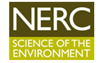
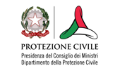
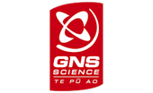
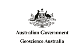

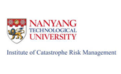
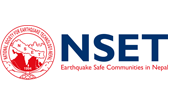
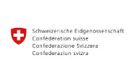
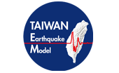

Private Partners
----------------

*********
Governors
*********

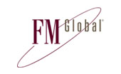
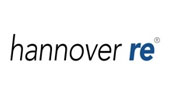
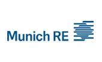
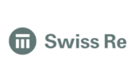

********
Advisors
********

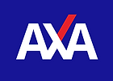

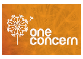
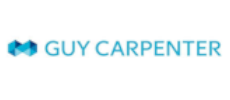
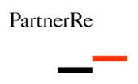

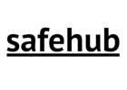

Associate Partners
------------------

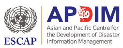

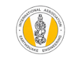
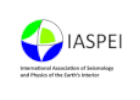
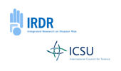
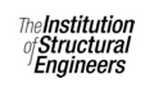
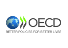
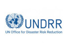

Project Partners
----------------

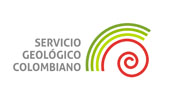

Project Distribution Partners
-----------------------------

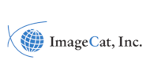

-------

If you would like to help support development of OpenQuake engine, please contact us at partnership@globalquakemodel.org. For 
more info visit the GEM website at https://www.globalquakemodel.org/partners