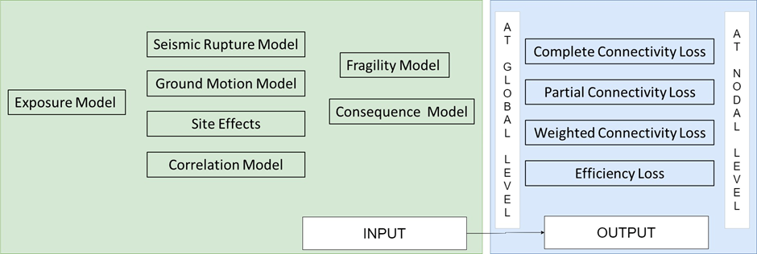
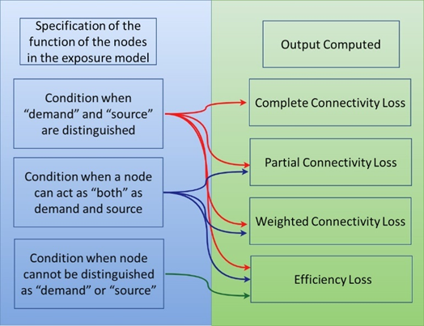

Infrastructure Risk Analysis
============================

Rationale
---------

Critical infrastructures, whose components are interconnected and behave as a system, are vital for the functioning of 
the society. Unlike the portfolio of the buildings whose total loss can be calculated by simply aggregating the losses 
from the individual component unit, it is not straightforward for critical infrastructures as they possess the complex 
network property to behave synergistically.

Risk assessment of critical infrastructures is limited due to the underlying complexities and lack of integrated tools 
that can compute from hazard characterization to risk assessment at system level. Therefore, in order to aid the 
assessment of infrastructures extensively and globally, this implementation has been carried out.

As of now, risk assessment at connenctivity level using topology based network analysis has been carried out. This can be 
uniformly used for different types of critical infrastructures including water supply systems, electric power networks, 
transporation systems, natural gas, etc.

Specification of the Input Model
--------------------------------

Critical infrastructures are represented as graph-like components consisting of nodes/vertices connected by edges/links. 
The graph can be simple undirected, directed, multi or multidirected type. To each of these types, the graph can be 
weighted or unweighted. If not specified, the default is simple unweighted undirected graph. In order to generate the 
graphs, the adjustment should be made in the **exposure.csv** file. Additional to the usual information, it should also 
include the columns **type**, **start_node**, **end_node**, **demand_or_supply**.

A snippet of exposure model for nodes and edges for a simple unweighted graph is shown in :ref:`Fig 2.8 <Fig. 2.8>` and :ref:`Fig. 2.9 <Fig. 2.9>`.

.. _Fig. 2.8:
.. figure:: _images/infrastructure-nodes.png

   Fig. 2.8 Example of the exposure model of nodes of the infrastructure

.. _Fig. 2.9:
.. figure:: _images/infrastructure-edges.png

   Fig. 2.9 Example of the exposure model of edges of the infrastructure

If the weights are to be added, there should be a column name **weights**, and weights can be travel time, distance, 
importance factor, etc., according to the user requirement.

*Note: If weight is not present, it assigns 1 as weight to every edge while calculating Weighted Connectivity Loss(WCL) 
and Efficiency Loss(EL)*

If the user wants to specify the graph type, another column **graphtype** must be added. It can be either “directed”, 
“multi”, “multidirected” or “simple”.

Hazard model and fragility model are similar to other comuptations. In order to do the network analysis, it is important 
to define if each component is functional/operational or not, which is defined by the damage states. For this, an 
additional consequence model is necessary (see :ref:`Fig. 2.10 <Fig. 2.10>`). As of now, only the binary state is considered i.e 
“functional/operational” or “non-functional/non-operational”.

.. _Fig. 2.10:
.. figure:: _images/infrastructure-consequence-model.png

   Fig. 2.10 Example of the consequence model (Note: 0 implies still operational and 1 implies non-operational)

Calculation Steps
-----------------

1. Preparation of input models, which includes:

  - Exposure model
  - Hazard model
  - Fragility model
  - Consequence model

2. Computation of the specific damage states and assignment of functionality/operationality to each component
3. Creation of original network from the exposure model
4. Update of the functionality of each component to the originally created infrastructure network and removal of the non-functional/non-operational components
5. Network analysis based on the original and updated infrastructure network
6. Computation of the following performance metrics, based on connectivity analysis:

  - Complete Connectivity Loss (CCL)
  - Partial Connectivity Loss (PCL)
  - Weighted Connectivity Loss (WCL)
  - Efficiency Loss (EL)

In summary, for the computation of infrastructure risk at connectivity level in OpenQuake engine, the input requirements and 
the outputs obtained are shown in :ref:`Fig. 2.11 <Fig. 2.11>`.

.. _Fig. 2.11:

  Fig. 2.11 Input models required, and output obtained in OpenQuake for infrastructure risk assessment at connectivity level

Specification of the Outputs Obtained
-------------------------------------

- For the classic generic case where “demand” and “supply” are explicity mentioned in the column **demand_or_supply**, all four metrics are computed for overall network. Also, at nodal level, all the four metrics are calculated.
- If some nodes behave as both supply and demand, and are assigned as “both” or “TAZ” (traffic analysis zone) in the column **demand_or_supply**, PCL, WCL and EL are computed for both nodal level and overall network.
- If there is no assignment of “demand” or “supply” to the column **demand_or_supply**, only EL is computed for overall network. Also, at nodal level, for all the nodes, EL only is computed.

For the simplification, :ref:`Fig. 2.12 <Fig. 2.12>` has been added to understand what can be obtained by various specifications.

.. _Fig. 2.12:

  Fig. 2.12 Output computed from the implementation according to the specification of the function of the nodes

Mainly, the library, NetworkX (Aric et al. 2008) has been used during the implementation. Further details can be found in 
Poudel et al. 2023. Also, much concept during the implementation has been drawn from Pitilakis et al. 2014.

Useful References
-----------------

1. Aric A. Hagberg, Daniel A. Schult and Pieter J. Swart (2008) Exploring network structure, dynamics, and function using NetworkX, in Proceedings of the 7th Python in Science Conference (SciPy2008), Gäel Varoquaux, Travis Vaught, and Jarrod Millman (Eds), (Pasadena, CA USA), pp. 11–15
2. Poudel, A., Pitilakis, K., Silva, V. and Rao, A., (2023). Infrastructure seismic risk assessment: an overview and integration to contemporary open tool towards global usage. Bulletin of Earthquake Engineering. DOI: https://doi.org/10.1007/s10518-023-01693-z
3. Pitilakis, K, Franchin P, Khazai B, & Wenzel H, (Eds.) (2014) SYNER-G: systemic seismic vulnerability and risk assessment of complex urban, utility, lifeline systems and critical facilities: methodology and applications (Vol. 31), Springer, DOI: https://doi.org/10.1007/978-94-017-8835-9

Acknowledgements
----------------

The present work has been done in the framework of grant agreement No. 813137 funded by the European Commission ITN-Marie 
Sklodowska-Curie project “New Challenges for Urban Engineering Seismology (URBASIS-EU)” by Astha Poudel, ESR 4.5 
(Aristotle University of Thessaloniki, Université Grenoble Alpes) with the support from Kyriazis Pitilakis, Vitor Silva, 
Anirudh Rao, and Michele Simionato. Also, we would like to acknowledge the contributors of the SYNER-G project that was 
funded from the European Community’s 7th Framework Program under grant No. 244061 from which many conceptual frameworks 
have been built upon.