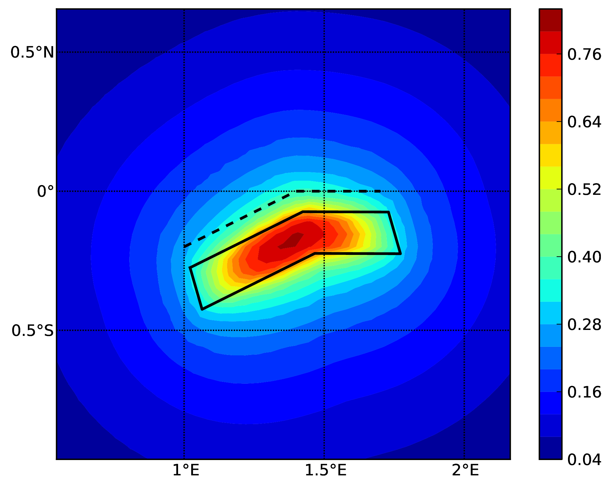

Demonstrative Examples for Hazard Module
========================================

A number of hazard calculation demos are provided with the OpenQuake engine installation, showing different examples of 
input and configuration files, for different use cases.

This is the list of demos which illustrate how to use the OpenQuake engine for various seismic hazard analysis:

- AreaSourceClassicalPSHA
- CharacteristicFaultSourceCase1ClassicalPSHA
- CharacteristicFaultSourceCase2ClassicalPSHA
- CharacteristicFaultSourceCase3ClassicalPSHA
- ComplexFaultSourceClassicalPSHA
- Disaggregation
- EventBasedPSHA
- LogicTreeCase1ClassicalPSHA
- LogicTreeCase2ClassicalPSHA
- LogicTreeCase3ClassicalPSHA
- PointSourceClassicalPSHA
- SimpleFaultSourceClassicalPSHA

Classical PSHA Demos
--------------------

A number of demos have been designed to show how to perform a classical PSHA calculation using the different available 
source typologies and how to define non-trivial logic trees. It should be noted that the input files that will be 
illustrated are valid not only for a classical PSHA calculation but also for event based and disaggregation analysis.

All the classical PSHA demos illustrating the different source typologies (all demos but the ones about Logic Tree 
definition) share the same GSIM logic tree file, which for clarity is provided in the listing below.

Since this logic tree considers only one tectonic region (i.e. ``Active Shallow Crust``) all the seismic sources will 
be considered active shallow crust sources.::

	<?xml version="1.0" encoding="UTF-8"?>
	<nrml xmlns:gml="http://www.opengis.net/gml"
	      xmlns="http://openquake.org/xmlns/nrml/0.5">
	    <logicTree logicTreeID="lt1">
	            <logicTreeBranchSet uncertaintyType="gmpeModel"
	                    branchSetID="bs1"
	                    applyToTectonicRegionType="Active Shallow Crust">
	
	                <logicTreeBranch branchID="b1">
	                    <uncertaintyModel>
	                    ChiouYoungs2008
	                    </uncertaintyModel>
	                    <uncertaintyWeight>1.0</uncertaintyWeight>
	                </logicTreeBranch>
	
	            </logicTreeBranchSet>
	    </logicTree>
	</nrml>

***********************************************
Classical PSHA with different source typologies
***********************************************

This section discusses the following examples:

- AreaSourceClassicalPSHA
- CharacteristicFaultSourceCase1ClassicalPSHA
- CharacteristicFaultSourceCase2ClassicalPSHA
- CharacteristicFaultSourceCase3ClassicalPSHA
- ComplexFaultSourceClassicalPSHA
- PointSourceClassicalPSHA
- SimpleFaultSourceClassicalPSHA

The configuration file in the listing is defined to compute hazard curves for several intensity measure types (PGV, PGA 
and Spectral acceleration at different periods), hazard maps and uniform hazard spectra for different probabilities of 
exceedance::

	[general]
	description = ...
	calculation_mode = classical
	random_seed = 23
	
	[geometry]
	region = ...
	region_grid_spacing = 5.0
	
	[logic_tree]
	number_of_logic_tree_samples = 0
	
	[erf]
	rupture_mesh_spacing = 2
	width_of_mfd_bin = 0.1
	area_source_discretization = 5.0
	
	[site_params]
	reference_vs30_type = measured
	reference_vs30_value = 600.0
	reference_depth_to_2pt5km_per_sec = 5.0
	reference_depth_to_1pt0km_per_sec = 100.0
	
	[calculation]
	source_model_logic_tree_file = source_model_logic_tree.xml
	gsim_logic_tree_file = gmpe_logic_tree.xml
	investigation_time = 50.0
	intensity_measure_types_and_levels = {"PGV": [2, 4, 6 ,8, 10, ...],
	                                      "PGA": [0.005, 0.007, ...],
	                                      "SA(0.025)": [...],
	                                      "SA(0.05)": [...],
	                                      "SA(0.1)": [...],
	                                      "SA(0.2)": [...],
	                                      "SA(0.5)": [...],
	                                      "SA(1.0)": [...],
	                                      "SA(2.0)": [...]}
	truncation_level = 3
	maximum_distance = 200.0
	
	[output]
	mean = false
	quantiles = 0.15, 0.50, 0.85
	hazard_maps = true
	uniform_hazard_spectra = true
	poes = 0.10, 0.02

Hazard maps (for PGA, 10% in 50 years) for the different demos using various oq-engine source typologies are shown in the 
figures below:

.. _Fig. 1.1:
.. figure:: _images/point.png

   Fig. 1.1 Point Source (a).

.. _Fig. 1.2:
.. figure:: _images/area.png

   Fig. 1.2 Area source (b). The solid black line represents the area boundary.

.. _Fig. 1.3:
.. figure:: _images/simple_fault.png

   Fig. 1.3 Simple Fault Source (c). The dashed line represents the fault trace, while the solid line the fault surface projection.

.. _Fig. 1.4:

   Fig. 1.4 (d) Complex Fault Source. The solid line represent the fault surface projection

Hazard maps (for PGA, 10% in 50 years) as obtained from characteristic fault sources with simple fault geometry (a), 
complex fault geometry (b), and collection of planar surfaces (c)

.. _Fig. 1.5:
.. figure:: _images/char_fault2.png

   Fig. 1.5 characteristic fault source with simple fault geometry

.. _Fig. 1.6:
.. figure:: _images/char_fault3.png

   Fig. 1.6 characteristic fault source with complex fault geometry

.. _Fig. 1.7:
.. figure:: _images/char_fault1.png

   Fig. 1.7 characteristic fault source with collection of planar surfaces

*******************************************
Classical PSHA with non trivial logic trees
*******************************************

Three demos are provided to illustrate how the logic tree formalism can be used to express epistemic uncertainties in 
seismic hazard analysis.

LogicTreeCase1ClassicalPSHA shows an example of logic tree defining two alternative source models, with sources belonging 
to two different tectonic region types, and with two alternative GMPEs for each tectonic region type. The source model 
logic tree is therefore defined as shown in the listing below.::

	<?xml version="1.0" encoding="UTF-8"?>
	<nrml xmlns:gml="http://www.opengis.net/gml"
	      xmlns="http://openquake.org/xmlns/nrml/0.5">
	    <logicTree logicTreeID="lt1">
	
	            <logicTreeBranchSet uncertaintyType="sourceModel"
	                                branchSetID="bs1">
	                <logicTreeBranch branchID="b1">
	                    <uncertaintyModel>
	                      source_model_1.xml
	                    </uncertaintyModel>
	                    <uncertaintyWeight>0.5</uncertaintyWeight>
	                </logicTreeBranch>
	                <logicTreeBranch branchID="b2">
	                    <uncertaintyModel>
	                       source_model_2.xml
	                    </uncertaintyModel>
	                    <uncertaintyWeight>0.5</uncertaintyWeight>
	                </logicTreeBranch>
	            </logicTreeBranchSet>
	
	    </logicTree>
	</nrml>

The two source models are defined in two separate files: ``source_model_1.xml`` and ``source_model_2.xml`` each one 
associated to a corresponding weight (0.5 for both).

The GSIM logic tree file contains the structure as shown in the listing below.::

	<?xml version="1.0" encoding="UTF-8"?>
	
	<nrml xmlns:gml="http://www.opengis.net/gml"
	      xmlns="http://openquake.org/xmlns/nrml/0.5">
	    <logicTree logicTreeID="lt1">
	
	            <logicTreeBranchSet uncertaintyType="gmpeModel"
	               applyToTectonicRegionType="Active Shallow Crust"
	               branchSetID="bs1">
	                <logicTreeBranch branchID="b11">
	                   <uncertaintyModel>
	                      BooreAtkinson2008
	                   </uncertaintyModel>
	                   <uncertaintyWeight>0.5</uncertaintyWeight>
	                </logicTreeBranch>
	                <logicTreeBranch branchID="b12">
	                   <uncertaintyModel>
	                      ChiouYoungs2008
	                   </uncertaintyModel>
	                   <uncertaintyWeight>0.5</uncertaintyWeight>
	                </logicTreeBranch>
	            </logicTreeBranchSet>
	
	            <logicTreeBranchSet uncertaintyType="gmpeModel"
	              applyToTectonicRegionType="Stable Continental Crust"
	              branchSetID="bs2">
	              <logicTreeBranch branchID="b21">
	                <uncertaintyModel>
	                   ToroEtAl2002</uncertaintyModel>
	                <uncertaintyWeight>0.5</uncertaintyWeight>
	                </logicTreeBranch>
	                <logicTreeBranch branchID="b22">
	                  <uncertaintyModel>
	                     Campbell2003</uncertaintyModel>
	                  <uncertaintyWeight>0.5</uncertaintyWeight>
	                </logicTreeBranch>
	            </logicTreeBranchSet>
	
	    </logicTree>
	</nrml>

The source model contains sources belonging to Active Shallow Crust and Stable Continental Crust, therefore the GSIM 
logic tree defines two branching levels, one for each considered tectonic region type. Moreover for each tectonic region 
a Branch set with two GMPEs is defined: Boore and Atkinson 2008 and Chiou and Youngs 2008 for Active Shallow Crust and 
Toro et al. 2003 and Campbell 2003 for Stable Continental Crust. By processing the above logic tree files using the logic 
tree path enumeration mode (enabled by setting in the configuration file ``number_of_logic_tree_samples = 0``) hazard 
results are computed for 8 logic tree paths (2 source models x 2 GMPEs for Active x 2 GMPEs for Stable).

LogicTreeCase2ClassicalPSHA defines a single source model consisting of only two sources (area and simple fault) 
belonging to different tectonic region types (Active Shallow Crust and Stable Continental Region) and both characterized 
by a truncated Gutenberg-Richter distribution. The logic tree defines uncertainties for G-R a and b values (three 
possible pairs for each source), maximum magnitude (three values for each source) and uncertainties on the GMPEs for each 
tectonic region type (two GMPE per region type).

To accommodate such a structure the GSIM logic tree is defined as shown in the listing below.::

	<?xml version="1.0" encoding="UTF-8"?>
	<nrml xmlns:gml="http://www.opengis.net/gml"
	      xmlns="http://openquake.org/xmlns/nrml/0.5">
	    <logicTree logicTreeID="lt1">
	
	            <logicTreeBranchSet uncertaintyType="sourceModel"
	                                branchSetID="bs1">
	                <logicTreeBranch branchID="b11">
	                    <uncertaintyModel>
	                     source_model.xml
	                    </uncertaintyModel>
	                    <uncertaintyWeight>1.0</uncertaintyWeight>
	                </logicTreeBranch>
	            </logicTreeBranchSet>
	
	            <logicTreeBranchSet uncertaintyType="abGRAbsolute"
	                                applyToSources="1"
	                                branchSetID="bs21">
	                <logicTreeBranch branchID="b21">
	                    <uncertaintyModel>4.6 1.1</uncertaintyModel>
	                    <uncertaintyWeight>0.333</uncertaintyWeight>
	                </logicTreeBranch>
	                <logicTreeBranch branchID="b22">
	                    <uncertaintyModel>4.5 1.0</uncertaintyModel>
	                    <uncertaintyWeight>0.333</uncertaintyWeight>
	                </logicTreeBranch>
	                <logicTreeBranch branchID="b23">
	                    <uncertaintyModel>4.4 0.9</uncertaintyModel>
	                    <uncertaintyWeight>0.334</uncertaintyWeight>
	                </logicTreeBranch>
	            </logicTreeBranchSet>
	
	            <logicTreeBranchSet uncertaintyType="abGRAbsolute"
	                                applyToSources="2"
	                                branchSetID="bs31">
	                <logicTreeBranch branchID="b31">
	                    <uncertaintyModel>3.3 1.0</uncertaintyModel>
	                    <uncertaintyWeight>0.333</uncertaintyWeight>
	                </logicTreeBranch>
	                <logicTreeBranch branchID="b32">
	                    <uncertaintyModel>3.2 0.9</uncertaintyModel>
	                    <uncertaintyWeight>0.333</uncertaintyWeight>
	                </logicTreeBranch>
	                <logicTreeBranch branchID="b33">
	                    <uncertaintyModel>3.1 0.8</uncertaintyModel>
	                    <uncertaintyWeight>0.334</uncertaintyWeight>
	                </logicTreeBranch>
	            </logicTreeBranchSet>
	
	            <logicTreeBranchSet uncertaintyType="maxMagGRAbsolute"
	                                applyToSources="1"
	                                branchSetID="bs41">
	                <logicTreeBranch branchID="b41">
	                    <uncertaintyModel>7.0</uncertaintyModel>
	                    <uncertaintyWeight>0.333</uncertaintyWeight>
	                </logicTreeBranch>
	                <logicTreeBranch branchID="b42">
	                    <uncertaintyModel>7.3</uncertaintyModel>
	                    <uncertaintyWeight>0.333</uncertaintyWeight>
	                </logicTreeBranch>
	                <logicTreeBranch branchID="b43">
	                    <uncertaintyModel>7.6</uncertaintyModel>
	                    <uncertaintyWeight>0.334</uncertaintyWeight>
	                </logicTreeBranch>
	            </logicTreeBranchSet>
	
	            <logicTreeBranchSet uncertaintyType="maxMagGRAbsolute"
	                                applyToSources="2"
	                                branchSetID="bs51">
	                <logicTreeBranch branchID="b51">
	                    <uncertaintyModel>7.5</uncertaintyModel>
	                    <uncertaintyWeight>0.333</uncertaintyWeight>
	                </logicTreeBranch>
	                <logicTreeBranch branchID="b52">
	                    <uncertaintyModel>7.8</uncertaintyModel>
	                    <uncertaintyWeight>0.333</uncertaintyWeight>
	                </logicTreeBranch>
	                <logicTreeBranch branchID="b53">
	                    <uncertaintyModel>8.0</uncertaintyModel>
	                    <uncertaintyWeight>0.334</uncertaintyWeight>
	                </logicTreeBranch>
	            </logicTreeBranchSet>
	
	    </logicTree>
	</nrml>

The first branching level defines the source model. For each source, two branching levels are created, one defining 
uncertainties on G-R a and b values (defined by setting ``uncertaintyType="abGRAbsolute"``) and G-R maximum magnitude 
(``uncertaintyType="maxMagGRAbsolute"``).

It is important to notice that each *Branch* set is applied to a specific source by defining the attribute ``applyToSources``, 
followed by the source ID. The GSIM logic tree file is the same as used for LogicTreeCase1ClassicalPSHA. By setting in 
the configuration file ``number_of_logic_tree_samples = 0``, hazard results are obtained for 324 paths (1 source model x 
3 (a, b) pairs for source 1 x 3 (a, b) pairs for source 2 x 3 max magnitude values for source 1 x 3 max magnitude values 
for source 2 x 2 GMPEs for Active Shallow Crust X 2 GMPEs for Stable Continental Crust), see :ref:`Fig. 1.8 <Fig. 1.8>`.

.. _Fig. 1.8:

   
    Fig. 1.8 Hazard curves as obtained from the LogicTreeCase2 demo. Solid gray lines represent individual hazard curves from the different logic tree path (a total of 324 curves). The red dashed line represents the mean hazard curve, while the red dotted lines depict the quantile levels (0.15, 0.5, 0.95).

LogicTreeCase3ClassicalPSHA illustrates an example of logic tree defining relative uncertainties on G-R maximum magnitude 
and b value. A single source model is considered containing two sources belonging to different tectonic region types and 
both characterized by a G-R magnitude frequency distribution. The source model logic tree for this demo is as shown in 
the listing below.::

	<?xml version="1.0" encoding="UTF-8"?>
	<nrml xmlns:gml="http://www.opengis.net/gml"
	      xmlns="http://openquake.org/xmlns/nrml/0.5">
	    <logicTree logicTreeID="lt1">
	
	            <logicTreeBranchSet uncertaintyType="sourceModel"
	                                branchSetID="bs1">
	                <logicTreeBranch branchID="b11">
	                    <uncertaintyModel>
	                     source_model.xml
	                    </uncertaintyModel>
	                    <uncertaintyWeight>1.0</uncertaintyWeight>
	                </logicTreeBranch>
	            </logicTreeBranchSet>
	
	            <logicTreeBranchSet uncertaintyType="bGRRelative"
	                                branchSetID="bs21">
	                <logicTreeBranch branchID="b21">
	                    <uncertaintyModel>+0.1</uncertaintyModel>
	                    <uncertaintyWeight>0.333</uncertaintyWeight>
	                </logicTreeBranch>
	                <logicTreeBranch branchID="b22">
	                    <uncertaintyModel>0.0</uncertaintyModel>
	                    <uncertaintyWeight>0.333</uncertaintyWeight>
	                </logicTreeBranch>
	                <logicTreeBranch branchID="b23">
	                    <uncertaintyModel>-0.1</uncertaintyModel>
	                    <uncertaintyWeight>0.334</uncertaintyWeight>
	                </logicTreeBranch>
	            </logicTreeBranchSet>
	
	            <logicTreeBranchSet uncertaintyType="maxMagGRRelative"
	                                branchSetID="bs31">
	                <logicTreeBranch branchID="b31">
	                    <uncertaintyModel>0.0</uncertaintyModel>
	                    <uncertaintyWeight>0.333</uncertaintyWeight>
	                </logicTreeBranch>
	                <logicTreeBranch branchID="b32">
	                    <uncertaintyModel>+0.5</uncertaintyModel>
	                    <uncertaintyWeight>0.333</uncertaintyWeight>
	                </logicTreeBranch>
	                <logicTreeBranch branchID="b33">
	                    <uncertaintyModel>+1.0</uncertaintyModel>
	                    <uncertaintyWeight>0.334</uncertaintyWeight>
	                </logicTreeBranch>
	            </logicTreeBranchSet>
	
	    </logicTree>
	</nrml>

After the first branching level defining the source model, two additional branching levels are defined, one defining 
relative uncertainties on b value (``bGRRelative`` applied consistently to all sources in the source model) and the 
second uncertainties on maximum magnitude (``maxMagGRRelative``). Similar to the other cases, two GMPEs are considered 
for each tectonic region type and therefore the total number of logic tree path is 36 (1 source model x 3 b value 
increments x 3 maximum magnitude increments x 2 GMPE for Active x 2 GMPEs for Stable).

Hazard Disaggregation Demos
---------------------------

An example of disaggregation calculation is given considering a source model consisting of two sources (area and simple 
fault) belonging to two different tectonic region types.

The calculation is defined with the following configuration file::

	[general]
	description = ...
	calculation_mode = disaggregation
	random_seed = 23
	
	[geometry]
	sites = 0.5 -0.5
	
	[logic_tree]
	number_of_logic_tree_samples = 0
	
	[erf]
	rupture_mesh_spacing = 2
	width_of_mfd_bin = 0.1
	area_source_discretization = 5.0
	
	[site_params]
	reference_vs30_type = measured
	reference_vs30_value = 600.0
	reference_depth_to_2pt5km_per_sec = 5.0
	reference_depth_to_1pt0km_per_sec = 100.0
	
	[calculation]
	source_model_logic_tree_file = source_model_logic_tree.xml
	gsim_logic_tree_file = gmpe_logic_tree.xml
	investigation_time = 50.0
	intensity_measure_types_and_levels = {"PGA": [...]}
	truncation_level = 3
	maximum_distance = 200.0
	
	[disaggregation]
	poes_disagg = 0.1
	mag_bin_width = 1.0
	distance_bin_width = 10.0
	coordinate_bin_width = 0.2
	num_epsilon_bins = 3
	
	[output]
	export_dir = ...

Disaggregation matrices are computed for a single site (located between the two sources) for a ground motion value 
corresponding to a probability value equal to 0.1 (``poes_disagg = 0.1``). Magnitude values are classified in one 
magnitude unit bins (``mag_bin_width = 1.0``), distances in bins of 10 km (``distance_bin_width = 10.0``), coordinates 
in bins of 0.2 degrees (``coordinate_bin_width = 0.2``). 3 epsilons bins are considered (``num_epsilon_bins = 3``).

Event Based PSHA Demos
----------------------

A demo showing an example of Event Based PSHA calculation is provided with the following configuration file::

	[general]
	description = Event Based PSHA using Area Source
	calculation_mode = event_based
	random_seed = 23
	
	[geometry]
	sites = 0.5 -0.5
	
	[logic_tree]
	number_of_logic_tree_samples = 0
	
	[erf]
	rupture_mesh_spacing = 2
	width_of_mfd_bin = 0.1
	area_source_discretization = 5.0
	
	[site_params]
	reference_vs30_type = measured
	reference_vs30_value = 600.0
	reference_depth_to_2pt5km_per_sec = 5.0
	reference_depth_to_1pt0km_per_sec = 100.0
	
	[calculation]
	source_model_logic_tree_file = source_model_logic_tree.xml
	gsim_logic_tree_file = gmpe_logic_tree.xml
	investigation_time = 50.0
	intensity_measure_types_and_levels = {"PGA": [...]}
	truncation_level = 3
	maximum_distance = 200.0
	
	[event_based_params]
	ses_per_logic_tree_path = 100
	ground_motion_correlation_model =
	ground_motion_correlation_params =
	
	[output]
	export_dir = ...
	ground_motion_fields = true
	hazard_curves_from_gmfs = true
	mean = false
	quantiles =
	hazard_maps = true
	poes = 0.1

The source model consist of one source (area). 100 stochastic event sets are generated (``ses_per_logic_tree_path = 100``) 
(an example can be seen in :ref:`Fig. 1.9 <Fig. 1.9>`). Ground motion fields are computed (``ground_motion_fields = true``, :ref:`Fig. 1.10 <Fig. 1.10>` and 
:ref:`Fig 1.11 <Fig. 1.11>`) and also hazard curves from ground motion fields are extracted (``hazard_curves_from_gmfs = true``). The 
corresponding hazard maps for 0.1 probability are also calculated (``hazard_maps = true``)

.. _Fig. 1.9:

  Fig. 1.9 A stochastic event set generated with the event based PSHA demo. The area source defines a nodal plane distribution which distributes events among vertical and dipping (50 degrees) faults with equal weights. Vertical ruptures are then distributed equally in the range 0-180 degrees while the dipping ones in the range 0-360, both with a step of 45 degrees.

.. _Fig. 1.10:
.. figure:: _images/gmf-no-corr.png

  Fig. 1.10 Ground motion fields (PGA) with no spatial correlation

.. _Fig. 1.11:
.. figure:: _images/gmf-corr.png

  Fig. 1.11 Ground motion fields (PGA) with spatial correlation