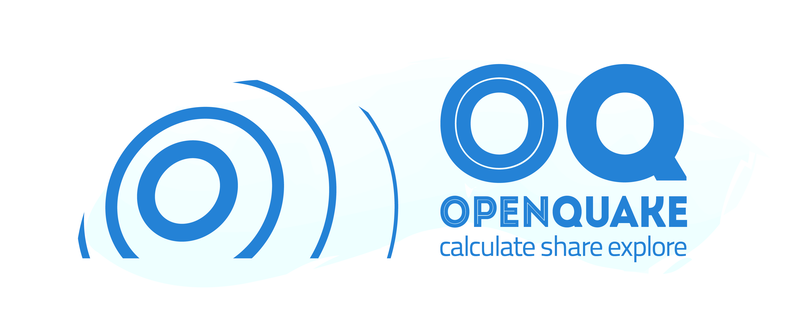

OpenQuake Engine Documentation
==============================

OpenQuake engine is the seismic hazard and risk calculation software developed by the GEM 
Foundation. By following current standards in software developments like test-driven development 
and continuous integration, the OpenQuake engine aims at becoming an open, and community-driven 
tool for seismic hazard and risk analysis.

The source code of the OpenQuake engine is available on a public web-based repository at the 
following address: gem/oq-engine.

General overview
----------------

The OpenQuake Engine software provides calculation and assessment of seismic hazard, risk and 
decision-making tools via the data, methods and standards that are being developed by 
**GEM** (Global Earthquake Model) and its collaborators.

.. grid:: 2

    .. grid-item-card::  :ref:`Getting Started`
	:text-align: center

	:octicon:`rocket;5em;sd-text-info`
	^^^

    .. grid-item-card::  :ref:`User Guide`
	:text-align: center

	:octicon:`book;5em;sd-text-info`
	^^^

.. grid:: 2

    .. grid-item-card::  :ref:`API Reference`
	:text-align: center

	:octicon:`code-square;5em;sd-text-info`
	^^^

    .. grid-item-card::  :ref:`Underlying Science`
	:text-align: center

	:octicon:`archive;5em;sd-text-info`
	^^^

An introduction video for the OpenQuake engine is presented below:

.. youtube:: DDDzNDrf4bo
   :align: center

Contacts
--------

- Support forum: https://groups.google.com/g/openquake-users
- X/Twitter: https://x.com/gem_devs
- Email: info@openquake.org

.. toctree::
   :hidden:

   getting-started/index
   user-guide/index
   api-reference/index
   underlying-science/index
   release-notes/index
   contributing/index