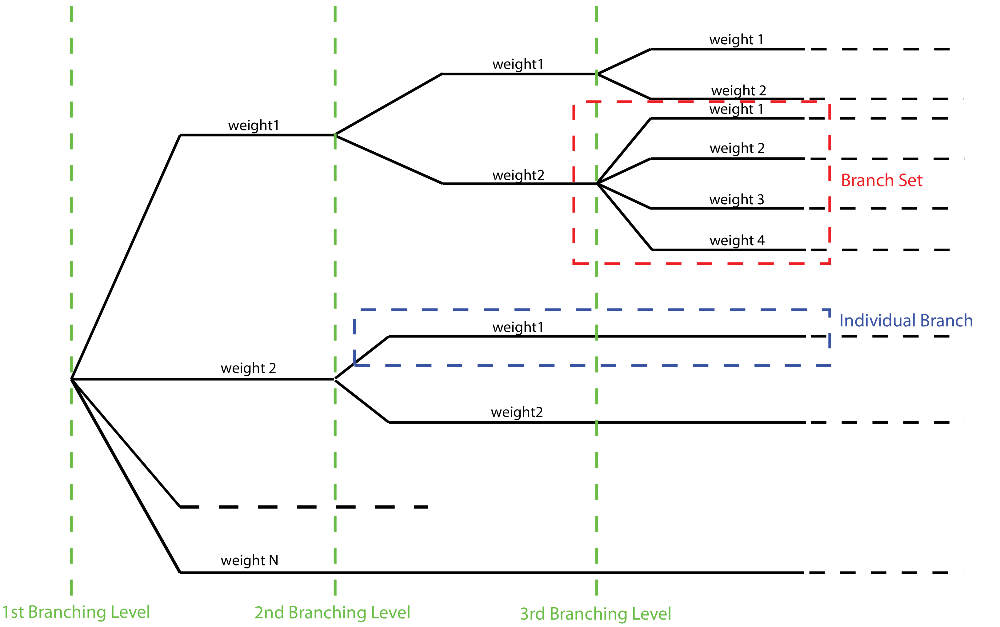

Logic Trees
===========

Defining Logic Trees
--------------------

The main components of a logic tree structure in the OpenQuake engine are the following:

**Branch:**
   The simplest component of a logic tree structure. A Branch represent a possible interpretation of a value assignment 
   for a specific type of uncertainty. It is fully described by the tuple (parameter or model, weight).

**Branching set:**
   It is a key component in the logic tree structure used by the OpenQuake engine. It groups a set of branches i.e. 
   alternative interpretations of a parameter or a model. Each branching set is defined by:

   - An ID
   - An uncertainty type (for a comprehensive list of the types of uncertainty currently supported see section Logic trees as described in the nrml schema)
   - One or more branches

   This set of uncertainties can be applied to the whole initial seismic source input model or just to a subset of 
   seismic sources. The sum of the weights/probabilities assigned to the set of branches always correspond to one.

Below we provide a simple schema illustrating the skeleton of xml file containing the desciption of a logic tree::

	    <logicTreeBranchSet branchSetID=ID
	                        uncertaintyType=TYPE>
	        <logicTreeBranch>
	            <uncertaintyModel>VALUE</uncertaintyModel>
	            <uncertaintyWeight>WEIGHT</uncertaintyWeight>
	        </logicTreeBranch>
	    </logicTreeBranchSet>

As it appears from this example, the structure of a logic tree is a set of nested elements.

A schematic representation of the elemental components of a logic tree structure is provided in Fig. 2.10. A Branch set 
identifies a collection of branches (i.e. individual branches) whose weights sum to 1.

   Figure 3.2 Generic Logic Tree structure as described in terms of Branch sets, and individual branches.

Logic trees as described in the nrml schema
-------------------------------------------

In the NRML schema, a logic tree structure is defined through the ``logicTree`` element::

	<logicTree logicTreeID="ID">
	...
	</logicTree>

A ``logicTree`` contains as a sequence of ``logicTreeBranchSet`` elements.

There are no restrictions on the number of Branch set that can be defined.

Each ``logicTreeBranchSet`` has two required attributes: ``branchSetID`` and ``uncertaintyType``. The latter defines the 
type of epistemic uncertainty this *Branch* set is describing.::

	<logicTree logicTreeID="ID">
	             <logicTreeBranchSet branchSetID="ID_1"
	                     uncertaintyType="UNCERTAINTY_TYPE">
	                     ...
	             </logicTreeBranchSet>
	             <logicTreeBranchSet branchSetID="ID_2"
	                     uncertaintyType="UNCERTAINTY_TYPE">
	                     ...
	             </logicTreeBranchSet>
	             ...
	             <logicTreeBranchSet branchSetID="ID_N"
	                     uncertaintyType="UNCERTAINTY_TYPE">
	                     ...
	             </logicTreeBranchSet>
	...
	</logicTree>

Possible values for the ``uncertaintyType`` attribute are:

- ``gmpeModel``: indicates epistemic uncertainties on ground motion prediction equations
- ``sourceModel``: indicates epistemic uncertainties on source models
- ``maxMagGRRelative``: indicates relative (i.e. increments) epistemic uncertainties to be added (or subtracted, depending on the sign of the increment) to the Gutenberg-Richter maximum magnitude value.
- ``bGRRelative``: indicates relative epistemic uncertainties to be applied to the Gutenberg-Richter b value.
- ``abGRAbsolute``: indicates absolute (i.e. values used to replace original values) epistemic uncertainties on the Gutenberg-Richter a and b values.
- ``maxMagGRAbsolute``: indicates (absolute) epistemic uncertainties on the Gutenberg-Richter maximum magnitude.
- ``incrementalMFDAbsolute``: indicates (absolute) epistemic uncertainties on the incremental magnitude frequency distribution (i.e. alternative rates and/or minimum magnitude) of a specific source (can only be applied to individual sources)
- ``simpleFaultGeometryAbsolute``: indicates alternative representations of the simple fault geometry for an individual simple fault source
- ``simpleFaultDipRelative``: indicates a relative increase or decrease in fault dip for one or more simple fault sources
- ``simpleFaultDipAbsolute``: indicates alternative values of fault dip for one or more simple fault sources
- ``complexFaultGeometryAbsolute``: indicates alternative representations of complex fault geometry for an individual complex fault source
- ``characteristicFaultGeometryAbsolute``: indicates alternative representations of the characteristic fault geometry for an individual characteristic fault source

A ``branchSet`` is defined as a sequence of ``logicTreeBranch`` elements, each specified by an ``uncertaintyModel`` 
element (a string identifying an uncertainty model; the content of the string varies with the ``uncertaintyType`` 
attribute value of the branchSet element) and the ``uncertaintyWeight`` element (specifying the probability/weight 
associated to the ``uncertaintyModel``)::

	< logicTree  logicTreeID="ID">
	...
	
	             < logicTreeBranchSet  branchSetID="ID_#"
	                             uncertaintyType="UNCERTAINTY_TYPE">
	                     < logicTreeBranch  branchID="ID_1">
	                             <uncertaintyModel>
	                                 UNCERTAINTY_MODEL
	                             </uncertaintyModel>
	                             <uncertaintyWeight>
	                                 UNCERTAINTY_WEIGHT
	                             </uncertaintyWeight>
	                     </ logicTreeBranch >
	                     ...
	                     < logicTreeBranch  branchID="ID_N">
	                             <uncertaintyModel>
	                                 UNCERTAINTY_MODEL
	                             </uncertaintyModel>
	                             <uncertaintyWeight>
	                                 UNCERTAINTY_WEIGHT
	                             </uncertaintyWeight>
	                     </logicTreeBranch>
	             </logicTreeBranchSet>
	...
	</logicTree >

Depending on the ``uncertaintyType`` the content of the ``<uncertaintyModel>`` element changes:

- if ``uncertaintyType="gmpeModel"``, the uncertainty model contains the name of a ground motion prediction equation 
  (a list of available GMPEs can be obtained using ``oq info gsims`` and these are also documented at: 
  http://docs.openquake.org/oq-engine/stable/openquake.hazardlib.gsim.html)::

	<uncertaintyModel>GMPE_NAME</uncertaintyModel>

- if ``uncertaintyType="sourceModel"``, the uncertainty model contains the paths to a source model file, e.g.::

	<uncertaintyModel>SOURCE_MODEL_FILE_PATH</uncertaintyModel>

- if ``uncertaintyType="maxMagGRRelative"``, the uncertainty model contains the increment to be added (or subtracted, 
  depending on the sign) to the Gutenberg-Richter maximum magnitude::
	
	<uncertaintyModel>MAX_MAGNITUDE_INCREMENT</uncertaintyModel>

- if ``uncertaintyType="bGRRelative"``, the uncertainty model contains the increment to be added (or subtracted, 
  depending on the sign) to the Gutenberg-Richter b value::
	
	<uncertaintyModel>B_VALUE_INCREMENT</uncertaintyModel>

- if ``uncertaintyType="abGRAbsolute"``, the uncertainty model must contain one a and b pair::
	
	<uncertaintyModel>A_VALUE B_VALUE</uncertaintyModel>

- if ``uncertaintyType="maxMagGRAbsolute"``, the uncertainty model must contain one Gutenberg-Richter maximum magnitude 
  value::

	<uncertaintyModel>MAX_MAGNITUDE</uncertaintyModel>

- if ``uncertaintyType="incrementalMFDAbsolute"``, the uncertainty model must contain an instance of the incremental MFD 
  node::

	<uncertaintyModel>
	    <incrementalMFD
	        minMag="MIN MAGNITUDE"
	        binWidth="BIN WIDTH">
	        <occurRates>RATE_1 RATE_2 ... RATE_N</occurRates>
	    </incrementalMFD>
	</uncertaintyModel>

- if ``uncertaintyType="simpleFaultGeometryAbsolute"`` then the uncertainty model must contain a *valid* instance of the 
  ``simpleFaultGeometry`` node as described in section `Simple Faults <https://docs.openquake.org/oq-engine/master/manual/hazard.html#desc-simple-fault>`_

- if ``uncertaintyType="simpleFaultDipRelative"`` then the uncertainty model must specify the number of degrees to 
  increase (positive) or decrease (negative) the fault dip. Note that if this increase results in an adjusted fault dip 
  greater than 90 degrees or less than 0 degrees an error will occur.::

	<uncertaintyModel>DIP_INCREMENT</uncertaintyModel>

- if ``uncertaintyType="simpleFaultDipAbsolute"`` then the uncertainty model must specify the dip angle (in degrees)::

	<uncertaintyModel>DIP</uncertaintyModel>

- if ``uncertaintyType="complexFaultGeometryAbsolute"`` then the uncertainty model must contain a *valid* instance of the 
  ``complexFaultGeometry`` source node as described in section `Complex Faults <https://docs.openquake.org/oq-engine/master/manual/hazard.html#desc-complex-fault>`_

- if ``uncertaintyType="characteristicFaultGeometryAbsolute"`` then the uncertainty model must contain a *valid* instance 
  of the ``characteristicFaultGeometry`` source node, as described in section `Characteristic faults <https://docs.openquake.org/oq-engine/master/manual/hazard.html#desc-characteristic-fault>`_

There are no restrictions on the number of logicTreeBranch elements that can be defined in a logicTreeBranchSet, as long as the uncertainty weights sum to 1.0.

The ``logicTreeBranchSet`` element offers also a number of optional attributes allowing for complex tree definitions:

- ``applyToBranches``: specifies to which ``logicTreeBranch`` elements (one or more), in the previous *Branch* sets, the 
  *Branch* set is linked to. The linking is established by defining the IDs of the branches to link to::

	applyToBranches="branchID1 branchID2 .... branchIDN"

  The default is the keyword ALL, which means that a *Branch* set is by default linked to all branches in the previous 
  *Branch* set. By specifying one or more branches to which the Branch set links to, non-symmetric logic trees can be 
  defined.

- ``applyToSources``: specifies to which source in a source model the uncertainty applies to. Sources are specified in 
  terms of their IDs::

	applyToSources="srcID1 srcID2 .... srcIDN"

- ``applyToTectonicRegionType``: specifies to which tectonic region type the uncertainty applies to. Only one tectonic 
  region type can be defined (``Active Shallow Crust``, ``Stable Shallow Crust``, ``Subduction Interface``, ``Subduction 
  IntraSlab``, ``Volcanic``), e.g.:

	applyToTectonicRegionType="Active Shallow Crust"

The Seismic Source System
-------------------------

The Seismic Source System contains the model (or the models) describing position, geometry and activity of seismic 
sources of engineering importance for a set of sites as well as the possible epistemic uncertainties to be incorporated 
into the calculation of seismic hazard.

*****************************
The Seismic Source Logic Tree
*****************************

The structure of the Seismic Source Logic Tree consists of at least one *Branch Set*. The example provided below shows 
the simplest Seismic Source Logic Tree structure that can be defined in a *Psha Input Model* for OpenQuake engine. It’s 
a logic tree with just onebranchset with one *Branch* used to define the initial seismic source model (its weight will 
be equal to one).::

	<?xml version="1.0" encoding="UTF-8"?>
	<nrml xmlns:gml="http://www.opengis.net/gml"
	      xmlns="http://openquake.org/xmlns/nrml/0.5">
	    <logicTree logicTreeID="lt1">
	            <logicTreeBranchSet uncertaintyType="sourceModel"
	                                branchSetID="bs1">
	                <logicTreeBranch branchID="b1">
	                    <uncertaintyModel>seismic_source_model.xml
	                    </uncertaintyModel>
	                    <uncertaintyWeight>1.0</uncertaintyWeight>
	                </logicTreeBranch>
	            </logicTreeBranchSet>
	    </logicTree>
	</nrml>

The optional branching levels will contain rules that modify parameters of the sources in the initial seismic source 
model.

For example, if the epistemic uncertainties to be considered are source geometry and maximum magnitude, the modeller 
can create a logic tree structure with three initial seismic source models (each one exploring a different definition of 
the geometry of sources) and one branching level accounting for the epistemic uncertainty on the maximum magnitude.

Below we provide an example of such logic tree structure. Note that the uncertainty on the maximum magnitude is specified 
in terms of relative increments with respect to the initial maximum magnitude defined for each source in the initial 
seismic source models.::

	<?xml version="1.0" encoding="UTF-8"?>
	<nrml xmlns:gml="http://www.opengis.net/gml"
	      xmlns="http://openquake.org/xmlns/nrml/0.5">
	    <logicTree logicTreeID="lt1">
	
	            <logicTreeBranchSet uncertaintyType="sourceModel"
	                                branchSetID="bs1">
	                <logicTreeBranch branchID="b1">
	                    <uncertaintyModel>seismic_source_model_A.xml
	                    </uncertaintyModel>
	                    <uncertaintyWeight>0.2</uncertaintyWeight>
	                </logicTreeBranch>
	                <logicTreeBranch branchID="b2">
	                    <uncertaintyModel>seismic_source_model_B.xml
	                    </uncertaintyModel>
	                    <uncertaintyWeight>0.3</uncertaintyWeight>
	                </logicTreeBranch>
	                <logicTreeBranch branchID="b3">
	                    <uncertaintyModel>seismic_source_model_C.xml
	                    </uncertaintyModel>
	                    <uncertaintyWeight>0.5</uncertaintyWeight>
	                </logicTreeBranch>
	            </logicTreeBranchSet>
	
	            <logicTreeBranchSet branchSetID="bs21"
	                    uncertaintyType="maxMagGRRelative">
	                <logicTreeBranch branchID="b211">
	                    <uncertaintyModel>+0.0</uncertaintyModel>
	                    <uncertaintyWeight>0.6</uncertaintyWeight>
	                </logicTreeBranch>
	                <logicTreeBranch branchID="b212">
	                    <uncertaintyModel>+0.5</uncertaintyModel>
	                    <uncertaintyWeight>0.4</uncertaintyWeight>
	                </logicTreeBranch>
	            </logicTreeBranchSet>
	
	    </logicTree>
	</nrml>

Starting from OpenQuake engine v2.4, it is also possible to split a source model into several files and read them as if 
they were a single file. The file names for the different files comprising a source model should be provided in the 
source model logic tree file. For instance, a source model could be split by tectonic region using the following syntax 
in the source model logic tree::

	<?xml version="1.0" encoding="UTF-8"?>
	<nrml xmlns:gml="http://www.opengis.net/gml"
	      xmlns="http://openquake.org/xmlns/nrml/0.5">
	    <logicTree logicTreeID="lt1">
	            <logicTreeBranchSet uncertaintyType="sourceModel"
	                                branchSetID="bs1">
	                <logicTreeBranch branchID="b1">
	                    <uncertaintyModel>
	                     active_shallow_sources.xml
	                     stable_shallow_sources.xml
	                    </uncertaintyModel>
	                    <uncertaintyWeight>1.0</uncertaintyWeight>
	                </logicTreeBranch>
	            </logicTreeBranchSet>
	    </logicTree>
	</nrml>

************************
The Seismic Source Model
************************

The structure of the xml file representing the seismic source model corresponds to a list of sources, each one modelled 
using one out of the five typologies currently supported. Below we provide a schematic example of a seismic source model::

	<?xml version="1.0" encoding="UTF-8"?>
	<nrml xmlns:gml="http://www.opengis.net/gml"
	      xmlns="http://openquake.org/xmlns/nrml/0.5">
	    <logicTree logicTreeID="lt1">
	            <logicTreeBranchSet uncertaintyType="sourceModel"
	                                branchSetID="bs1">
	                <logicTreeBranch branchID="b1">
	                    <uncertaintyModel>seismic_source_model.xml
	                    </uncertaintyModel>
	                    <uncertaintyWeight>1.0</uncertaintyWeight>
	                </logicTreeBranch>
	            </logicTreeBranchSet>
	    </logicTree>
	</nrml>

The Ground Motion System
------------------------

The Ground Motion System defines the models and the possible epistemic uncertainties related to ground motion modelling 
to be incorporated into the calculation.

****************************
The Ground Motion Logic Tree
****************************

The structure of the Ground Motion Logic Tree consists of a list of ground motion prediction equations for each tectonic 
region used to characterise the sources in the PSHA input model.

The example below in shows a simple *Ground Motion Logic Tree*. This logic tree assumes that all the sources in the PSHA 
input model belong to “Active Shallow Crust” and uses for calculation the B. S.-J. Chiou and Youngs (2008) Ground Motion 
Prediction Equation.::

	<?xml version="1.0" encoding="UTF-8"?>
	<nrml xmlns:gml="http://www.opengis.net/gml"
	      xmlns="http://openquake.org/xmlns/nrml/0.5">
	    <logicTree logicTreeID="lt1">
	            <logicTreeBranchSet uncertaintyType="gmpeModel"
	                    branchSetID="bs1"
	                    applyToTectonicRegionType="Active Shallow Crust">
	
	                <logicTreeBranch branchID="b1">
	                    <uncertaintyModel>
	                    ChiouYoungs2008
	                    </uncertaintyModel>
	                    <uncertaintyWeight>1.0</uncertaintyWeight>
	                </logicTreeBranch>
	
	            </logicTreeBranchSet>
	    </logicTree>
	</nrml>