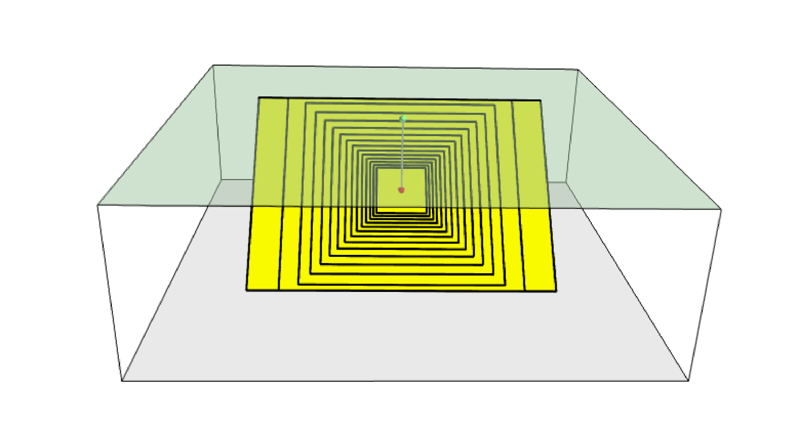
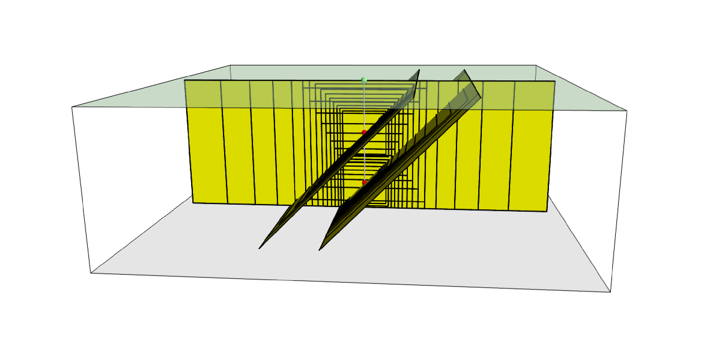
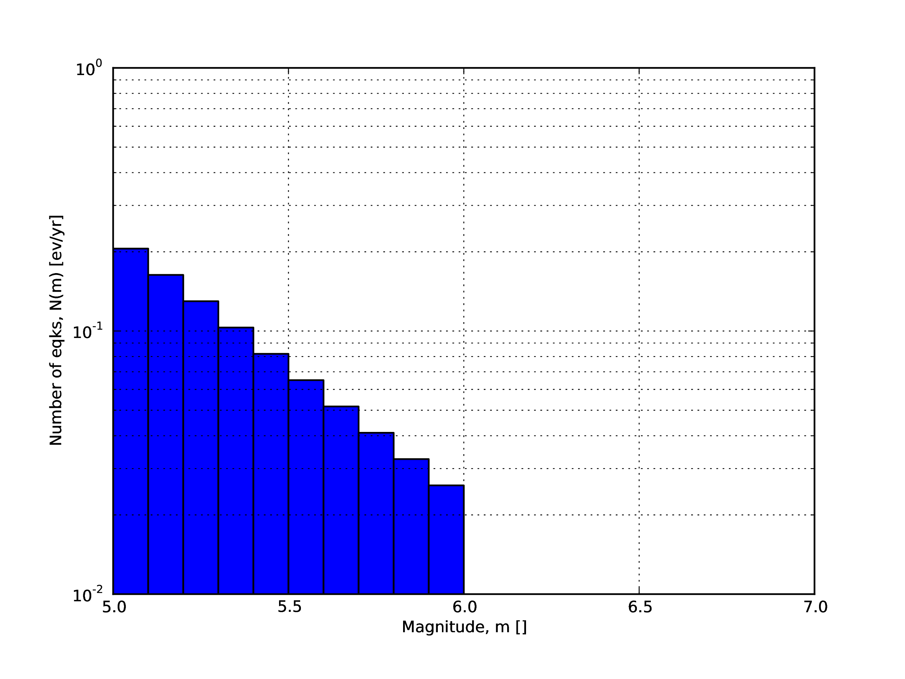
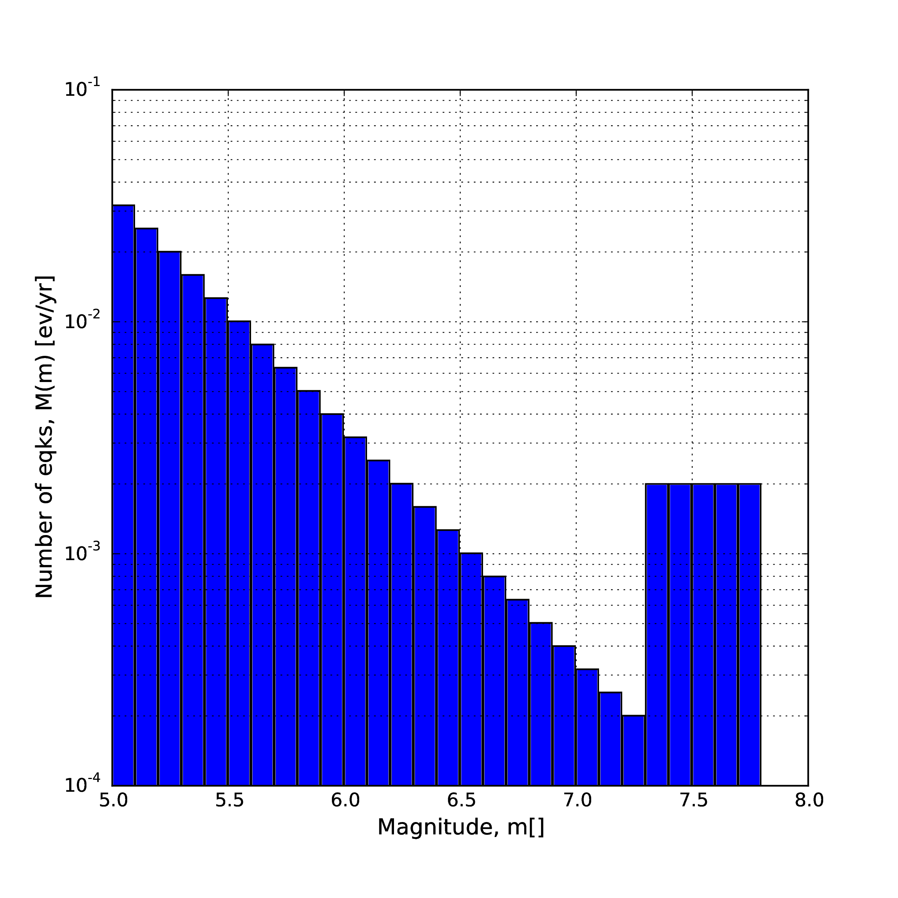
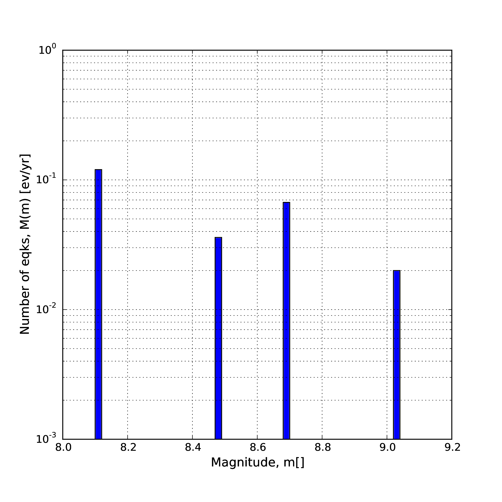

Seismic Source Model
====================

Source typologies
-----------------

An OpenQuake engine seismic source input model contains a list of sources belonging to a finite set of possible typologies. 
Each source type is defined by a set of parameters - called source data - which are used to specify the source geometry 
and the properties of seismicity occurrence.

Currently the OpenQuake engine supports the following source types:

- Sources for modelling distributed seismicity:

  - *Point Source* - The elemental source type used to model distributed seismicity. Grid and area sources (described below) are different containers of point sources.
  - *Area Source* - So far, the most frequently adopted source type in national and regional PSHA models.
  - *Grid Source* - A replacement for area sources admitting spatially variable seismicity occurrence properties.

- Fault sources with floating ruptures:

  - *Simple Fault Source* - The simplest fault model in the OpenQuake engine. This source is habitually used to describe shallow seismogenic faults.
  - *Complex Fault Source* - Often used to model subduction interface sources with a complex geometry.

- Fault sources with ruptures always covering the entire fault surface:

  - *Characteristic Fault Source* - A typology of source where ruptures always fill the entire fault surface.
  - *Non-Parametric Source* - A typology of source representing a collection of ruptures, each with their associated probabilities of 0, 1, 2 … occurrences in the investigation time

- Sources for representing individual earthquake ruptures

  - *Planar fault rupture* - an individual fault rupture represented as a single rectangular plane
  - *Multi-planar fault rupture* - an individual rupture represented as a collection of rectangular planes
  - *Simple fault rupture* - an individual fault rupture represented as a simple fault surface
  - *Complex fault rupture* - an individual fault rupture represented as a complex fault surface

The OpenQuake engine contains some basic assumptions for the definition of these source typologies:

- In the case of area and fault sources, the seismicity is homogeneously distributed over the source;
- Seismicity temporal occurrence follows a Poissonian model.

The above sets of sources may be referred to as “parametric” sources, that is to say that the generation of the 
*Earthquake Rupture Forecast* is done by the OpenQuake engine based on the parameters of the sources set by the user. In 
some cases, particularly if the user wishes for the temporal occurrence model to be non-Poissonian (such as the lognormal 
or Brownian Passage Time models) a different type of behaviour is needed. For this OpenQuake-engine supports a 
*Non-Parametric Source* in which the *Earthquake Rupture Forecast* is provided explicitly by the user as a set of ruptures 
and their corresponding probabilities of occurrence.

******************************************************
Source typologies for modelling distributed seismicity
******************************************************

#############
Point sources
#############

.. figure:: _images/single_rupture.png
   
   Fig. 2.1 Single rupture

The point source is the elemental source type adopted in the OpenQuake-engine for modelling distributed seismicity. The 
OpenQuake engine always performs calculations considering finite ruptures, even in the case of point sources.

These are the basic assumptions used to generate ruptures with point sources:

- Ruptures have a rectangular shape
- Rupture hypocenter is located in the middle of the rupture
- Ruptures are limited at the top and at the bottom by two planes parallel to the sea level and placed at two characteristic depths named upper and lower seismogenic depths, respectively (see Fig. 2.1)

^^^^^^^^^^^
Source data
^^^^^^^^^^^

For the definition of a point source the following parameters are required (Fig. 2.1 shows some of the parameters 
described below, together with an example of the surface of a generated rupture):

- The coordinates of the point (i.e. longitude and latitude) [decimal degrees]
- The upper and lower seismogenic depths [km]
- One *Magnitude-Frequency Distribution*
- One magnitude-scaling relationship
- The rupture aspect ratio
- A distribution of nodal planes i.e. one (or several) instances of the following set of parameters:

  - strike [degrees]
  - dip [degrees]
  - rake [degrees]

- A magnitude independent depth distribution of hypocenters [km].

Fig. 2.2 shows ruptures generated by a point source for a range of magnitudes. Each rupture is centered on the single 
hypocentral position admitted by this point source. Ruptures are created by conserving the area computed using the 
specified magnitude-area scaling relatioship and the corresponding value of magnitude.

   
   Fig. 2.2 Point source with multiple ruptures. Note the change in the aspect ratio once the rupture width fills the entire seismogenic layer.

Below we provide the excerpt of an .xml file used to describe the properties of a point source. Note that in this example, 
ruptures occur on two possible nodal planes and two hypocentral depths. Fig. 2.3 shows the ruptures generated by the point 
source.::

	<pointSource id="1" name="point" tectonicRegion="Stable Continental Crust">
	     <pointGeometry>
	         <gml:Point>
	             <gml:pos>-122.0 38.0</gml:pos>
	         </gml:Point>
	         <upperSeismoDepth>0.0</upperSeismoDepth>
	         <lowerSeismoDepth>10.0</lowerSeismoDepth>
	    </pointGeometry>
	    <magScaleRel>WC1994</magScaleRel>
	    <ruptAspectRatio>0.5</ruptAspectRatio>
	    <truncGutenbergRichterMFD aValue="-3.5" bValue="1.0" minMag="5.0"
	                                maxMag="6.5" />
	    <nodalPlaneDist>
	         <nodalPlane probability="0.3" strike="0.0" dip="90.0" rake="0.0" />
	         <nodalPlane probability="0.7" strike="90.0" dip="45.0" rake="90.0" />
	    </nodalPlaneDist>
	    <hypoDepthDist>
	        <hypoDepth probability="0.5" depth="4.0" />
	        <hypoDepth probability="0.5" depth="8.0" />
	    </hypoDepthDist>
	</pointSource>

   
   Fig. 2.3 Ruptures produced by the source created using the information in the example .xml file described on page.

############
Grid sources
############

A *Grid Source* is simply a collection of point sources distributed over a regular grid (usually equally spaced in 
longitude and latitude). In *Probabilistic Seismic Hazard Analysis* a grid source can be considered a model alternative 
to area sources, since they both model distributed seismicity. Grid sources are generally used to reproduce more 
faithfully the spatial pattern of seismicity depicted by the earthquakes occurred in the past; in some models (e.g. 
Petersen et al. (2008)) only events of low and intermediate magnitudes are considered. They are frequently, though not 
always, computed using seismicity smoothing algorithms (Frankel 1995; Woo 1996, amongst many others).

The use of smoothing algorithms to produce grid sources brings some advantages compared to area sources, since (1) it 
removes most of the unavoidable degree of subjectivity due to the definition of the geometries of the area sources and (2) 
it produces a spatial pattern of seismicity that is usually closer to what observed in the reality. Nevertheless, in 
many cases smoothing algorithms require an a-priori definition of some setup parameters that expose the calculation to a 
certain degree of partiality.

Grid sources are modeled in OpenQuake engine simply as a set of point sources; in other words, a grid source is just a 
long list of point sources specified as described in the previous section.

############
Area sources
############

Area sources are usually adopted to describe the seismicity occurring over wide areas where the identification and 
characterization - i.e. the unambiguous definition of position, geometry and seismicity occurrence parameters - of 
single fault structures is difficult.

From a computation standpoint, area sources are comparable to grid sources since they are both represented in the engine 
by a list of point sources.

The OpenQuake engine using the source data parameters (see below) creates an equally spaced in distance grid of point 
sources where each point has the same seismicity occurrence properties (i.e. rate of events generated).

Below we provide a brief description of the parameters necessary to completely describe an area source.

^^^^^^^^^^^^^^^^^^^^^^^^^^^
Source data in area sources
^^^^^^^^^^^^^^^^^^^^^^^^^^^

- A polygon defining the external border of the area (i.e. a list of Longitude-Latitude [degrees] tuples) The current version of the OQ-engine doesn’t support the definition of internal borders.
- The upper and lower seismogenic depths [km]
- One *Magnitude-Frequency Distribution*
- One *Magnitude-Scaling Relationship*
- The rupture aspect ratio
- A distribution of nodal planes i.e. one (or several) instances of the following set of parameters

  - strike [degrees]
  - dip [degrees]
  - rake [degrees]

- A magnitude independent depth distribution of hypocenters [km].

Below we provide the excerpt of an .xml file used to describe the properties of an area source. The ruptures generated 
by the area source described in the example are controlled by two nodal planes and have hypocenters at localized at two 
distinct depths.::

	<areaSource id="1" name="Quito" tectonicRegion="Active Shallow Crust">
	    <areaGeometry>
	      <gml:Polygon>
	        <gml:exterior>
	          <gml:LinearRing>
	            <gml:posList>
	              -122.5 37.5
	              -121.5 37.5
	              -121.5 38.5
	              -122.5 38.5
	            </gml:posList>
	          </gml:LinearRing>
	        </gml:exterior>
	      </gml:Polygon>
	      <upperSeismoDepth>0.0</upperSeismoDepth>
	      <lowerSeismoDepth>10.0</lowerSeismoDepth>
	    </areaGeometry>
	    <magScaleRel>PeerMSR</magScaleRel>
	    <ruptAspectRatio>1.5</ruptAspectRatio>
	    <incrementalMFD minMag="6.55" binWidth="0.1">
	        <occurRates>0.0010614989 8.8291627E-4 7.3437777E-4 6.108288E-4
	                    5.080653E-4</occurRates>
	    </incrementalMFD>
	    <nodalPlaneDist>
	        <nodalPlane probability="0.3" strike="0.0" dip="90.0" rake="0.0"/>
	        <nodalPlane probability="0.7" strike="90.0" dip="45.0" rake="90.0"/>
	    </nodalPlaneDist>
	    <hypoDepthDist>
	        <hypoDepth probability="0.5" depth="4.0" />
	        <hypoDepth probability="0.5" depth="8.0" />
	    </hypoDepthDist>
	</areaSource>

************************************
Fault sources with floating ruptures
************************************
Fault sources in the OpenQuake engine are classified according to the method adopted to distribute ruptures over the 
fault surface. Two options are currently supported:

- With the first option, ruptures with a surface lower than the whole fault surface are floated so as to cover as much as possible homogeneously the fault surface. This model is compatible with all the supported magnitude-frequency distributions.
- With the second option, ruptures always fill the entire fault surface. This model is compatible with magnitude-frequency distributions similar to a characteristic model (à la (Schwartz and Coppersmith 1984)).

In this subsection we discuss the different fault source types that support floating ruptures. In the next subsection we 
will illustrate the fault typology available to model a characteristic rupturing behaviour.

#############
Simple Faults
#############

Simple Faults are the most common source type used to model shallow faults; the “simple” adjective relates to the 
geometry description of the source which is obtained by projecting the fault trace (i.e. a polyline) along a 
characteristic dip direction.

The parameters used to create an instance of this source type are described in the following paragraph.

^^^^^^^^^^^^^^^^^^^^^^^^^^^^
Source data in simple faults
^^^^^^^^^^^^^^^^^^^^^^^^^^^^

- A horizontal Fault Trace (usually a polyline). It is a list of longitude-latitude tuples [degrees].
- A Frequency-Magnitude Distribution
- A Magnitude-Scaling Relationship
- A representative value of the dip angle (specified following the Aki-Richards convention; see Aki and Richards (2002)) [degrees]
- Rake angle (specified following the Aki-Richards convention; see Aki and Richards (2002)) [degrees]
- Upper and lower depth values limiting the seismogenic interval [km]

For near-fault probabilistic seismic hazard analysis, two additional parameters are needed for characterising seismic 
sources:

- A hypocentre list. It is a list of the possible hypocentral positions, and the corresponding weights, e.g., alongStrike=”0.25” downDip=”0.25” weight=”0.25”. Each hypocentral position is defined in relative terms using as a reference the upper left corner of the rupture and by specifying the fraction of rupture length and rupture width.
- A slip list. It is a list of the possible rupture slip directions [degrees], and their corresponding weights. The angle describing each slip direction is measured counterclockwise using the fault strike direction as reference.

In near-fault PSHA calculations, the hypocentre list and the slip list are mandatory. The weights in each list must 
always sum to one. The available GMPE which currently supports the near-fault directivity PSHA calculation in OQ- engine 
is the ChiouYoungs2014NearFaultEffect GMPE developed by Brian S.-J. Chiou and Youngs (2014) (associated with an `Active 
Shallow Crust` tectonic region type).

We provide two examples of simple fault source files. The first is an excerpt of an xml file used to describe the 
properties of a simple fault source and the second example shows the excerpt of an xml file used to describe the 
properties of a simple fault source that can be used to perform a PSHA calculation taking into account directivity 
effects.::

	<simpleFaultSource id="1" name="Mount Diablo Thrust"
	        tectonicRegion="Active Shallow Crust">
	      <simpleFaultGeometry>
	          <gml:LineString>
	              <gml:posList>
	                  -121.82290 37.73010
	                  -122.03880 37.87710
	              </gml:posList>
	          </gml:LineString>
	          <dip>45.0</dip>
	          <upperSeismoDepth>10.0</upperSeismoDepth>
	          <lowerSeismoDepth>20.0</lowerSeismoDepth>
	      </simpleFaultGeometry>
	      <magScaleRel>WC1994</magScaleRel>
	      <ruptAspectRatio>1.5</ruptAspectRatio>
	      <incrementalMFD minMag="5.0" binWidth="0.1">
	          <occurRates>0.0010614989 8.8291627E-4 7.3437777E-4 6.108288E-4
	                      5.080653E-4</occurRates>
	      </incrementalMFD>
	      <rake>30.0</rake>
	      <hypoList>
	          <hypo alongStrike="0.25" downDip="0.25" weight="0.25"/>
	          <hypo alongStrike="0.25" downDip="0.75" weight="0.25"/>
	          <hypo alongStrike="0.75" downDip="0.25" weight="0.25"/>
	          <hypo alongStrike="0.75" downDip="0.75" weight="0.25"/>
	      </hypoList>
	      <slipList>
	          <slip weight="0.333">0.0</slip>
	          <slip weight="0.333">45.0</slip>
	          <slip weight="0.334">90.0</slip>
	      </slipList>
	</simpleFaultSource>

::

	<simpleFaultSource id="1" name="Mount Diablo Thrust"
	        tectonicRegion="Active Shallow Crust">
	     <simpleFaultGeometry>
	         <gml:LineString>
	             <gml:posList>
	                 -121.82290 37.73010
	                 -122.03880 37.87710
	             </gml:posList>
	         </gml:LineString>
	         <dip>45.0</dip>
	         <upperSeismoDepth>10.0</upperSeismoDepth>
	         <lowerSeismoDepth>20.0</lowerSeismoDepth>
	     </simpleFaultGeometry>
	     <magScaleRel>WC1994</magScaleRel>
	     <ruptAspectRatio>1.5</ruptAspectRatio>
	     <incrementalMFD minMag="5.0" binWidth="0.1">
	         <occurRates>0.0010614989 8.8291627E-4 7.3437777E-4 6.108288E-4
	                     5.080653E-4</occurRates>
	     </incrementalMFD>
	     <rake>30.0</rake>
	     <hypoList>
	         <hypo alongStrike="0.25" downDip="0.25" weight="0.25"/>
	         <hypo alongStrike="0.25" downDip="0.75" weight="0.25"/>
	         <hypo alongStrike="0.75" downDip="0.25" weight="0.25"/>
	         <hypo alongStrike="0.75" downDip="0.75" weight="0.25"/>
	     </hypoList>
	     <slipList>
	         <slip weight="0.333">0.0</slip>
	         <slip weight="0.333">45.0</slip>
	         <slip weight="0.334">90.0</slip>
	     </slipList>
	</simpleFaultSource>

##############
Complex Faults
##############

A complex fault differs from simple fault just by the way the geometry of the fault surface is defined and the fault 
surface is later created. The input parameters used to describe complex faults are, for the most part, the same used to 
describe the simple fault typology.

In the case of complex faults, the dip angle is not requested while the fault trace is substituted by two fault edges 
limiting the top and bottom of the fault surface. Additional curves lying over the fault surface can be specified to 
complement and refine the description of the fault surface geometry. Unlike the simple fault these edges are not required 
to be horizontal and may vary in elevation, i.e. the upper edge may represent the intersection between the exposed fault 
trace and the topographic surface, where positive values indicate below sea level, and negative values indicate above sea 
level.

Usually, we use complex faults to model intraplate megathrust faults such as the big subduction structures active in the 
Pacific (Sumatra, South America, Japan) but this source typology can be used also to create - for example - listric fault 
sources with a realistic geometry.::

	<complexFaultSource id="1" name="Cascadia Megathrust"
	                    tectonicRegion="Subduction Interface">
	    <complexFaultGeometry>
	        <faultTopEdge>
	            <gml:LineString>
	                <gml:posList>
	                    -124.704  40.363  0.5493260E+01
	                    -124.977  41.214  0.4988560E+01
	                    -125.140  42.096  0.4897340E+01
	                </gml:posList>
	            </gml:LineString>
	        </faultTopEdge>
	        <intermediateEdge>
	            <gml:LineString>
	                <gml:posList>
	                    -124.704  40.363  0.5593260E+01
	                    -124.977  41.214  0.5088560E+01
	                    -125.140  42.096  0.4997340E+01
	                </gml:posList>
	            </gml:LineString>
	        </intermediateEdge>
	        <intermediateEdge>
	            <gml:LineString>
	                <gml:posList>
	                    -124.704  40.363  0.5693260E+01
	                    -124.977  41.214  0.5188560E+01
	                    -125.140  42.096  0.5097340E+01
	                </gml:posList>
	            </gml:LineString>
	        </intermediateEdge>
	        <faultBottomEdge>
	            <gml:LineString>
	                <gml:posList>
	                    -123.829  40.347  0.2038490E+02
	                    -124.137  41.218  0.1741390E+02
	                    -124.252  42.115  0.1752740E+02
	                </gml:posList>
	            </gml:LineString>
	        </faultBottomEdge>
	    </complexFaultGeometry>
	    <magScaleRel>WC1994</magScaleRel>
	    <ruptAspectRatio>1.5</ruptAspectRatio>
	    <truncGutenbergRichterMFD aValue="-3.5" bValue="1.0" minMag="5.0"
	                              maxMag="6.5" />
	    <rake>30.0</rake>
	</complexFaultSource>

As with the previous examples, the red text highlights the parameters used to specify the source geometry, the parameters 
in green describe the rupture mechanism, the text in blue describes the magnitude-frequency distribution and the gray text 
describes the rupture properties.

***************************************
Fault sources without floating ruptures
***************************************

#####################
Characteristic faults
#####################

The characteristic fault source is a particular typology of fault created with the assumption that its ruptures will 
always cover the entire fault surface. As such, no floating is necessary on the surface. The characteristic fault may 
still take as input a magnitude frequency distribution. In this case, the fault surface can be represented either as a 
*Simple Fault Source* surface or as a *Complex Fault Source* surface or as a combination of rectangular ruptures as 
represented in Fig. 2.4. Mutiple surfaces containing mixed geometry types are also supported.

.. figure:: _images/multi_surface.png
   
   Fig. 2.4 Geometry of a multi-segmented characteristic fault composed of four rectangular ruptures as modelled in OpenQuake.

^^^^^^^^^^^^^^^^^^^^^^^^^^^^^^^^^^^^
Source data in characteristic faults
^^^^^^^^^^^^^^^^^^^^^^^^^^^^^^^^^^^^

- The characteristic rupture surface is defined through one of the following options:

  - A list of rectangular ruptures (“planar surfaces”)
  - A Simple Fault Source geometry
  - A Complex Fault Source geometry

- A Frequency-Magnitude Distribution.
- Rake angle (specified following the Aki-Richards convention; see Aki and Richards (2002)).
- Upper and lower depth values limiting the seismogenic interval.

A comprehensive example enumerating the possible rupture surface configurations is shown below.::

	<characteristicFaultSource id="5" name="characteristic source, simple fault"
	                           tectonicRegion="Volcanic">
	    <truncGutenbergRichterMFD aValue="-3.5" bValue="1.0"
	                              minMag="5.0" maxMag="6.5" />
	    <rake>30.0</rake>
	    <surface>
	        <!-- Characteristic Fault with a simple fault surface -->
	        <simpleFaultGeometry>
	            <gml:LineString>
	                <gml:posList>
	                    -121.82290 37.73010
	                    -122.03880 37.87710
	                </gml:posList>
	            </gml:LineString>
	            <dip>45.0</dip>
	            <upperSeismoDepth>10.0</upperSeismoDepth>
	            <lowerSeismoDepth>20.0</lowerSeismoDepth>
	        </simpleFaultGeometry>
	    </surface>
	</characteristicFaultSource>

::

	<characteristicFaultSource id="6" name="characteristic source, complex fault"
	                           tectonicRegion="Volcanic">
	    <incrementalMFD minMag="5.0" binWidth="0.1">
	        <occurRates>0.0010614989 8.8291627E-4 7.3437777E-4</occurRates>
	    </incrementalMFD>
	    <rake>60.0</rake>
	    <surface>
	        <!-- Characteristic source with a complex fault surface -->
	        <complexFaultGeometry>
	            <faultTopEdge>
	                <gml:LineString>
	                    <gml:posList>
	                       -124.704  40.363  0.5493260E+01
	                       -124.977  41.214  0.4988560E+01
	                       -125.140  42.096  0.4897340E+01
	                    </gml:posList>
	                </gml:LineString>
	            </faultTopEdge>
	            <faultBottomEdge>
	                <gml:LineString>
	                    <gml:posList>
	                        -123.829  40.347  0.2038490E+02
	                        -124.137  41.218  0.1741390E+02
	                        -124.252  42.115  0.1752740E+02
	                    </gml:posList>
	                </gml:LineString>
	            </faultBottomEdge>
	        </complexFaultGeometry>
	    </surface>
	</characteristicFaultSource>

::

	<characteristicFaultSource id="7" name="characteristic source, multi surface"
	                           tectonicRegion="Volcanic">
	    <truncGutenbergRichterMFD aValue="-3.6" bValue="1.0"
	                              minMag="5.2" maxMag="6.4" />
	    <rake>90.0</rake>
	    <surface>
	        <!-- Characteristic source with a collection of planar surfaces -->
	        <planarSurface>
	            <topLeft lon="-1.0" lat="1.0" depth="21.0" />
	            <topRight lon="1.0" lat="1.0" depth="21.0" />
	            <bottomLeft lon="-1.0" lat="-1.0" depth="59.0" />
	            <bottomRight lon="1.0" lat="-1.0" depth="59.0" />
	        </planarSurface>
	        <planarSurface strike="20.0" dip="45.0">
	             <topLeft lon="1.0" lat="1.0" depth="20.0" />
	             <topRight lon="3.0" lat="1.0" depth="20.0" />
	             <bottomLeft lon="1.0" lat="-1.0" depth="80.0" />
	             <bottomRight lon="3.0" lat="-1.0" depth="80.0" />
	         </planarSurface>
	    </surface>
	</characteristicFaultSource>

**********************
Non-Parametric Sources
**********************

####################
Non-Parametric Fault
####################

The non-parametric fault typology requires that the user indicates the rupture properties (rupture surface, magnitude, 
rake and hypocentre) and the corresponding probabilities of the rupture. The probabilities are given as a list of 
floating point values that correspond to the probabilities of :math:`0,1,2,......,N` occurrences of the rupture within 
the specified investigation time. Note that there is not, at present, any internal check to ensure that the 
investigation time to which the probabilities refer corresponds to that specified in the configuration file. As the 
surface of the rupture is set explicitly, no rupture floating occurs, and, as in the case of the characteristic fault 
source, the rupture surface can be defined as either a single planar rupture, a list of planar ruptures, a *Simple Fault 
Source* geometry, a *Complex Fault Source* geometry, or a combination of different geometries.

Comprehensive examples enumerating the possible configurations are shown below::

	<nonParametricSeismicSource id="1" name="A Non Parametric Planar Source"
	                            tectonicRegion="Some TRT">
	    <singlePlaneRupture probs_occur="0.544 0.456">
	        <magnitude>8.3</magnitude>
	        <rake>90.0</rake>
	        <hypocenter depth="26.101" lat="40.726" lon="143.0"/>
	        <planarSurface>
	            <topLeft depth="9.0" lat="41.6" lon="143.1"/>
	            <topRight depth="9.0" lat="40.2" lon="143.91"/>
	            <bottomLeft depth="43.202" lat="41.252" lon="142.07"/>
	            <bottomRight depth="43.202" lat="39.852" lon="142.91"/>
	        </planarSurface>
	    </singlePlaneRupture>
	    <multiPlanesRupture probs_occur="0.9244 0.0756">
	        <magnitude>6.9</magnitude>
	        <rake>0.0</rake>
	        <hypocenter depth="7.1423" lat="35.296" lon="139.31"/>
	        <planarSurface>
	            <topLeft depth="2.0" lat="35.363" lon="139.16"/>
	            <topRight depth="2.0" lat="35.394" lon="138.99"/>
	            <bottomLeft depth="14.728" lat="35.475" lon="139.19"/>
	            <bottomRight depth="14.728" lat="35.505" lon="139.02"/>
	        </planarSurface>
	        <planarSurface>
	            <topLeft depth="2.0" lat="35.169" lon="139.34"/>
	            <topRight depth="2.0" lat="35.358" lon="139.17"/>
	            <bottomLeft depth="12.285" lat="35.234" lon="139.45"/>
	            <bottomRight depth="12.285" lat="35.423" lon="139.28"/>
	        </planarSurface>
	    </multiPlanesRupture>
	</nonParametricSeismicSource>

::

	<nonParametricSeismicSource id="2" name="A Non Parametric (Simple) Source"
	                            tectonicRegion="Some TRT">
	    <simpleFaultRupture probs_occur="0.157 0.843">
	        <magnitude>7.8</magnitude>
	        <rake>90.0</rake>
	        <hypocenter depth="22.341" lat="43.624" lon="147.94"/>
	        <simpleFaultGeometry>
	            <gml:LineString>
	                <gml:posList>
	                    147.96 43.202
	                    148.38 43.438
	                    148.51 43.507
	                    148.68 43.603
	                    148.76 43.640
	                </gml:posList>
	            </gml:LineString>
	            <dip>30.0</dip>
	            <upperSeismoDepth>14.5</upperSeismoDepth>
	            <lowerSeismoDepth>35.5</lowerSeismoDepth>
	        </simpleFaultGeometry>
	    </simpleFaultRupture>
	</nonParametricSeismicSource>

::

	<nonParametricSeismicSource id="3" name="A Non Parametric (Complex) Source"
	                            tectonicRegion="Some TRT">
	    <complexFaultRupture probs_occur="0.157 0.843">
	        <magnitude>7.8</magnitude>
	        <rake>90.0</rake>
	        <hypocenter depth="22.341" lat="43.624" lon="147.94"/>
	        <complexFaultGeometry>
	            <faultTopEdge>
	                <gml:LineString>
	                    <gml:posList>
	                        148.76 43.64 5.0
	                        148.68 43.603 5.0
	                        148.51 43.507 5.0
	                        148.38 43.438 5.0
	                        147.96 43.202 5.0
	                    </gml:posList>
	                </gml:LineString>
	            </faultTopEdge>
	            <faultBottomEdge>
	               <gml:LineString>
	                    <gml:posList>
	                        147.92 44.002 35.5
	                        147.81 43.946 35.5
	                        147.71 43.897 35.5
	                        147.5 43.803 35.5
	                        147.36 43.727 35.5
	                    </gml:posList>
	                </gml:LineString>
	            </faultBottomEdge>
	        </complexFaultGeometry>
	    </complexFaultRupture>
	</nonParametricSeismicSource>

Magnitude-frequency distributions
---------------------------------

The magnitude-frequency distributions currently supported by the OpenQuake engine are the following:

**A discrete incremental magnitude-frequency distribution**
  It is the simplest distribution supported. It is defined by the minimum value of magnitude (representing the mid point 
  of the first bin) and the bin width. The distribution itself is simply a sequence of floats describing the annual 
  number of events for different bins. The maximum magnitude admitted by this magnitude-frequency distribution is just 
  the sum of the minimum magnitude and the product of the bin width by the number annual rate values. Below we provide 
  an example of the xml that should be incorporated in a seismic source description in order to define this Magnitude-
  Frequency Distribution.::

	<incrementalMFD minMag="5.05" binWidth="0.1">
	    <occurRates>0.15 0.08 0.05 0.03 0.015</occurRates>
	</incrementalMFD>

  The magnitude-frequency distribution obtained with the above parameters is represented in Fig. 2.5.

.. figure:: _images/ed_mfd.png
   
   Fig. 2.5 Example of an incremental magnitude-frequency distribution.

**A double truncated Gutenberg-Richter distribution**
  This distribution is described by means of a minimum ``minMag`` and maximum magnitude ``maxMag`` and by the :math: `a`
  and :math: `b` values of the Gutenberg-Richter relationship.

  The syntax of the xml used to describe this magnitude-frequency distribution is rather compact as demonstrated in the 
  following example::

	<truncGutenbergRichterMFD aValue="5.0" bValue="1.0" minMag="5.0"
	                          maxMag="6.0"/>

  Fig. 2.6 shows the magnitude-frequency distribution obtained using the parameters of the considered example.

   
   Fig. 2.6 Example of a double truncated Gutenberg-Richter magnitude-frequency distribution.

**Hybrid Characteristic earthquake model (à la (Youngs and Coppersmith 1985))**
  The hybrid characteristic earthquake model, presented by (Youngs and Coppersmith 1985), distributes seismic moment 
  proportionally between a characteristic model (for larger magnitudes) and an exponential model. The rate of events is 
  dependent on the magnitude of the characteristic earthquake, the b-value and the total moment rate of the system (Fig. 
  2.7). However, the total moment rate may be defined in one of two ways. If the total moment rate of the source is known, 
  as may be the case for a fault surface with known area and slip rate, then the distribution can be defined from the 
  total moment rate (in N-m) of the source directly. Alternatively, the distribution can be defined from the rate of 
  earthquakes in the characteristic bin, which may be preferable if the distribution is determined from observed 
  seismicity behaviour. The option to define the distribution according to the total moment rate is input as::

	<YoungsCoppersmithMFD minmag="5.0" bValue="1.0" binWidth="0.1"
	                      characteristicMag="7.0" totalMomentRate="1.05E19"/>

  whereas the option to define the distribution from the rate of the characteristic events is given as::

	<YoungsCoppersmithMFD minmag="5.0" bValue="1.0" binWidth="0.1"
	                      characteristicMag="7.0" characteristicRate="0.005"/>

  Note that in this distribution the width of the magnitude bin must be defined explicitly in the model.

   
   Fig. 2.7 (Youngs and Coppersmith 1985) magnitude-frequency distribution.

**“Arbitrary” Magnitude Frequency Distribution**
  The arbitrary magnitude frequency distribution is another non-parametric form of MFD, in which the rates are defined 
  explicitly. Here, the magnitude frequency distribution is defined by a list of magnitudes and their corresponding 
  rates of occurrence. There is no bin-width as the rates correspond exactly to the specific magnitude. Unlike the 
  evenly discretised MFD, there is no requirement that the magnitudes be equally spaced. This distribution (illustrated 
  in Fig. 2.8) can be input as::

	<arbitraryMFD>
	    <occurRates>0.12 0.036 0.067 0.2</occurRates>
	    <magnitudes>8.1 8.47 8.68 9.02</magnitude>
	</arbitraryMFD>

   
   Fig. 2.8 “Arbitrary” magnitude-frequency distribution.

Magnitude-scaling relationships
-------------------------------

We provide below a list of the magnitude-area scaling relationships implemented in the OpenQuake hazard library 
(oq-hazardlib):

****************************************************************
Relationships for shallow earthquakes in active tectonic regions
****************************************************************
- (Wells and Coppersmith 1994) - One of the most well known magnitude scaling relationships, based on a global database of historical earthquake ruptures. The implemented relationship is the one linking magnitude to rupture area, and is called with the keyword ``WC1994``

**********************************************************
Magnitude-scaling relationships for subduction earthquakes
**********************************************************
- (Strasser, Arango, and Bommer 2010) - Defines several magnitude scaling relationships for interface and in-slab earthquakes. Only the magnitude to rupture-area scaling relationships are implemented here, and are called with the keywords ``StrasserInterface`` and ``StrasserIntraslab`` respectively.
- (Thingbaijam, Mai, and Goda 2017) - Define magnitude scaling relationships for interface. Only the magnitude to rupture-area scaling relationships are implemented here, and are called with the keywords ``ThingbaijamInterface``.

**********************************************************
Magnitude-scaling relationships stable continental regions
**********************************************************

- (EPRI 2011) - Defines a single magnitude to rupture-area scaling relationship for use in the central and eastern United States: :math:`Area = 10.0^{M_w-4.336}`. It is called with the keyword ``CEUS2011``

*********************************************
Miscellaneous Magnitude-Scaling Relationships
*********************************************

- ``PeerMSR`` defines a simple magnitude scaling relation used as part of the Pacific Earthquake Engineering Research Center verification of probabilistic seismic hazard analysis programs: :math:`Area = 10.0^{M_w-4.0}`.
- ``PointMSR`` approximates a ‘point’ source by returning an infinitesimally small area for all magnitudes. Should only be used for distributed seismicity sources and not for fault sources.